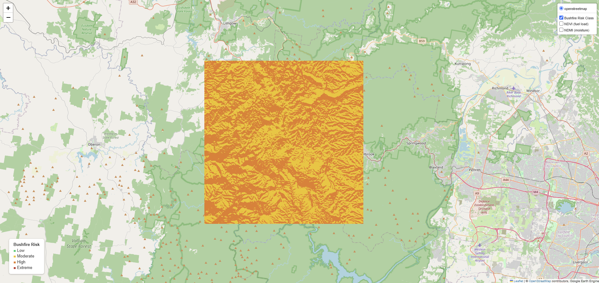

# NSW Bushfire Risk Mapping

An open-source geospatial pipeline that combines satellite-derived vegetation
indices with terrain analysis to produce a **bushfire risk index** for the
Blue Mountains region of NSW, Australia — the site of severe fire impacts
during the 2019–2020 "Black Summer" fire season.

**[View the interactive map →](outputs/blue_mountains_risk_map.html)**
*(open in browser after running the notebook, or view via nbviewer)*



## Why this project

Bushfire risk assessment sits at the intersection of remote sensing, GIS,
and environmental planning — directly relevant to bushfire management
planning, environmental consulting, and land-use risk assessment work in
NSW. This project demonstrates an end-to-end geospatial analysis workflow
using free, open satellite data and Google Earth Engine, without requiring
any proprietary software or licensing.

## Method

| Layer | Source | What it captures |
|---|---|---|
| NDVI | Sentinel-2 (B8, B4) | Vegetation density / available fuel load |
| NDMI | Sentinel-2 (B8, B11) | Canopy moisture content (proxy for dryness) |
| Slope | SRTM 30m DEM | Terrain steepness — fire spreads faster upslope |
| Solar exposure | SRTM-derived aspect | North-facing slopes receive more sun in the Southern Hemisphere and dry out faster |

These four layers are min-max normalised and combined into a weighted
**0–100 composite risk index**, then classified into four risk tiers:

- 🟩 **Low** (0–25)
- 🟨 **Moderate** (25–50)
- 🟧 **High** (50–75)
- 🟥 **Extreme** (75–100)

Default weights (editable in `src/risk_index.py`):

```
fuel_load (NDVI):       0.35
dryness (inverse NDMI):  0.35
slope:                   0.15
north-facing exposure:   0.15
```

## Repository structure

```
nsw-bushfire-risk-mapping/
├── notebooks/
│   ├── 01_bushfire_risk_mapping.ipynb   # end-to-end pipeline, runs in Colab
│   └── 02_validation.ipynb              # validates risk index vs FESM 2019/20 fire severity
├── src/
│   ├── risk_index.py                    # index calculation logic
│   ├── mapping.py                       # folium/GEE visualisation helpers
│   └── clip_fire_severity_raster.py     # run locally: clips raw SEED grid to the AOI
├── outputs/                              # generated maps + charts (created after running)
├── data/                                  # small, clipped reference raster (raw downloads gitignored)
├── requirements.txt
└── README.md
```

## How to run

This project uses Google Earth Engine, so it's designed to run in
**Google Colab** (free, and Earth Engine authentication is one click):

1. Open `notebooks/01_bushfire_risk_mapping.ipynb` in Colab
   ([open directly via this badge](https://colab.research.google.com/)).
2. Run the setup cell — it clones this repo and installs dependencies.
3. Run `ee.Authenticate()` and sign in with a Google account that has a
   [Google Earth Engine](https://code.earthengine.google.com/) project
   (free to register).
4. Run all remaining cells to generate the risk map for the Blue Mountains.
5. Change the `aoi` bounding box or `START_DATE` / `END_DATE` to test other
   regions or seasons.

## Validation approach

`notebooks/02_validation.ipynb` checks the risk index against what
actually happened on the ground: NSW's **Fire Extent and Severity Mapping
(FESM) 2019/20** dataset (via [NSW SEED](https://www.seed.nsw.gov.au/)),
which classifies every part of the 2019–20 fire footprint into
unburnt/low/moderate/high/extreme severity.

The SEED "Data Download Package" for FESM is an **ESRI Arc/Info Binary
Grid raster** (a folder of `.adf` files), not a shapefile — every pixel
carries a severity class code. Since the risk index is also a raster,
validation is done **pixel-to-pixel** rather than via polygon zonal
statistics.

Since the statewide grid is 100s of MB, it's clipped down locally first:

```bash
pip install rasterio
python src/clip_fire_severity_raster.py \
    --input "D:/download/FireSeverityFESM/fesm_201920" \
    --output data/fesm_2019_20_blue_mountains.tif
```

This produces a small GeoTIFF clipped to the same Blue Mountains bounding
box used in notebook 01 — safe to commit to GitHub, unlike the raw
statewide grid. The script prints the unique class codes found, which
should be cross-checked against the FESMv3 metadata PDF bundled with the
SEED download (codes aren't assumed — confirm them before trusting the
results).

`02_validation.ipynb` then exports the risk raster locally, aligns both
rasters onto the same pixel grid, and plots:
- a boxplot of risk index by observed severity class
- a heatmap cross-tabulating predicted risk class vs. observed severity

The expectation: areas that burned at high/extreme severity should show
a higher pre-season risk index than areas that stayed unburnt or burned
lightly.

## Limitations & next steps

- Single-date composite — a production version would use a time series to
  capture seasonal fuel curing trends.
- Weights are expert-assigned, not statistically calibrated — a logical
  next step is calibrating them against historical fire perimeter data
  using logistic regression or a Random Forest classifier.
- Does not yet incorporate fire weather (wind, temperature, humidity) —
  BOM forecast data could be integrated for a dynamic daily risk product.

## Author

Qifeng Wang — GIS & Remote Sensing, Sydney NSW
[LinkedIn] · [wqf971204@gmail.com](mailto:wqf971204@gmail.com)
